# Watson-Assistant-Speech-to-text
# Introduction

*Make an assistant with voice*- Tutorial created by Ahiram Cruz M.

The purpose of this tutorial is to discover and integrate 3 watson services: Speech to Text, Text to Speech and Watson Assistant.

## Learning Objectives

When you finished this path you will be able to:
- Make a Watson Speech To Text REST API call
- Make a Watson Text to Speech REST API call
- Send and receive messages to Watson Assistant using REST APIs
- Integrate Watson Speech To Text, Watson Text To Speech, and Watson Assistant in a web app
- Make a voice chat

**Estimated time:** 30 minutes

# Theoretical Framework

Chatbots are important to improve customer service and cost savings. Chatbots are available in many user interfaces and input forms. You can adapt them according to your needs, and in this tutorial we will adapt ito to control the dialog. 

### Watson Assistant

IBM Watson™ Assistant lets your to build your own branded live chatbot into any device, application, or channel. Your chatbot, which is also known as an assistant, connects to the customer engagement resources you already use to deliver an engaging, unified problem-solving experience to your customers.

### Speech to text

IBM Watson Speech to Text technology enables fast and accurate speech transcription in multiple languages for a variety of use cases, including but not limited to customer self-service, agent assistance and speech analytics.

### Text to Speech 

Watson Text to Speech can synthesize text to audio in many formats, it can produce male and female voices for various languages ​​and dialects. It offers concatenative and enhanced neural voices. The service accepts plain text and XML-based speech synthesis markup language (SSML) annotated text.

# Prerequisites

- [IBM Cloud Account](https://www.ibm.com/cloud): You must have an IBM Cloud account to take this tutorial
- Have Python on your local machine

# Flow

## Step 1: Clone the repo

1. Clone the repo to get the application:

` git clone https://github.ibm.com/developer-advocacy-latam/Data-Science-AI-for-beginners.git `

## Step 2: Create Watson Assistant Service on IBM Cloud

1. On the principal dashboard of IBM Cloud search for "Watson Assistant" and select it.

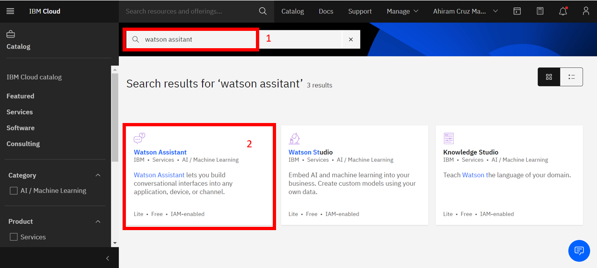

2. Select a region, choose the lite plan for your assistant, scroll down to assign a name and a description(optional). Then click on **Create**

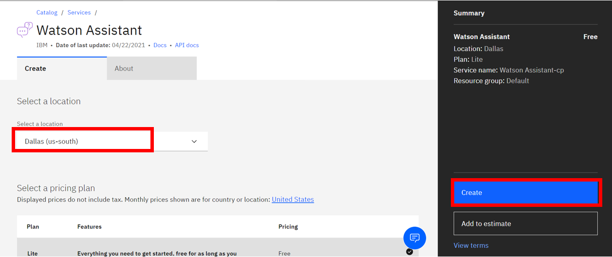

3. **Copy your credentials** (the API key and the URL) on a safe place, you will need them later to launch the application. Then click on **Launch Watson Assistant**.

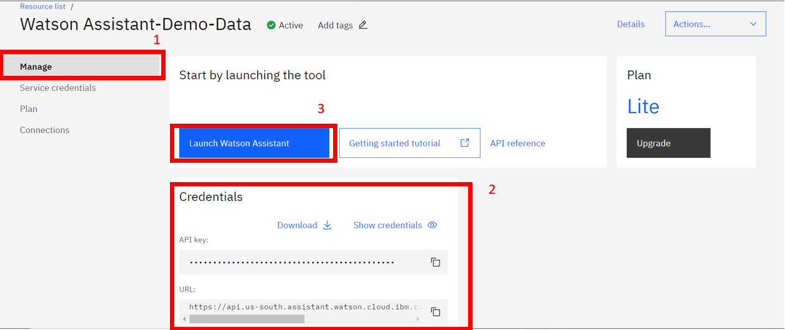

4. Click on **"Create Assistant"**

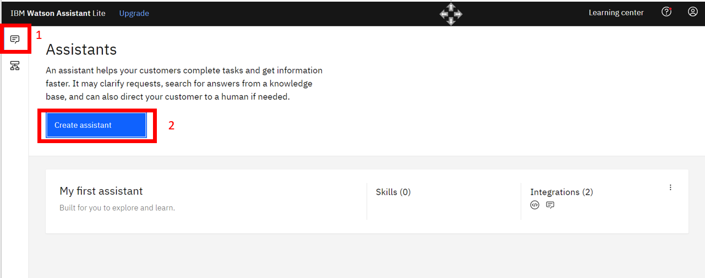

5. Give a name to your assitant and a description(optional).

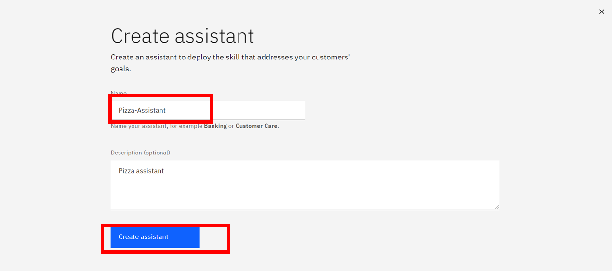

6. On the new page, in the dialog section, click on **Add dialog skill**.

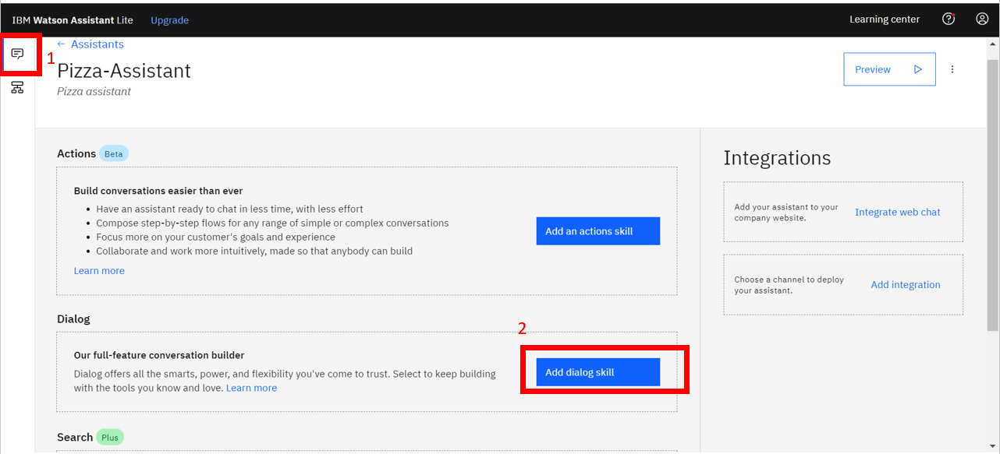

7. On the "Add skill page", select the **Upload Skill** tab. Select the file from: `05_ChatbotIntegration_STT_TTS_WAssistant/WA-Skill/pizza.json`

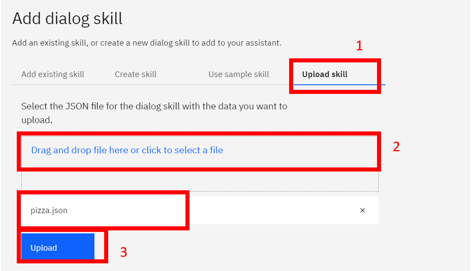

8. Go back to the "Assistants Page" and click the 3 dots of your assistant, select the **Settings options**

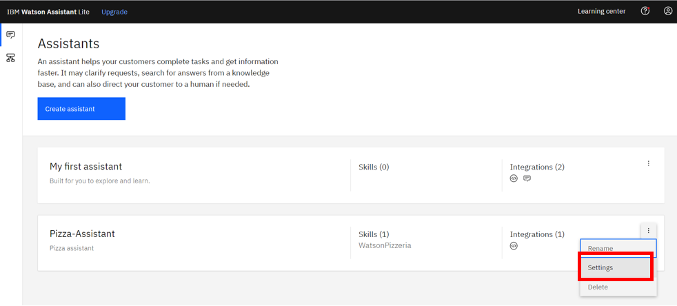

9. Copy the **Assitant ID** on a safe place with your previous credentials, you will need it after. 

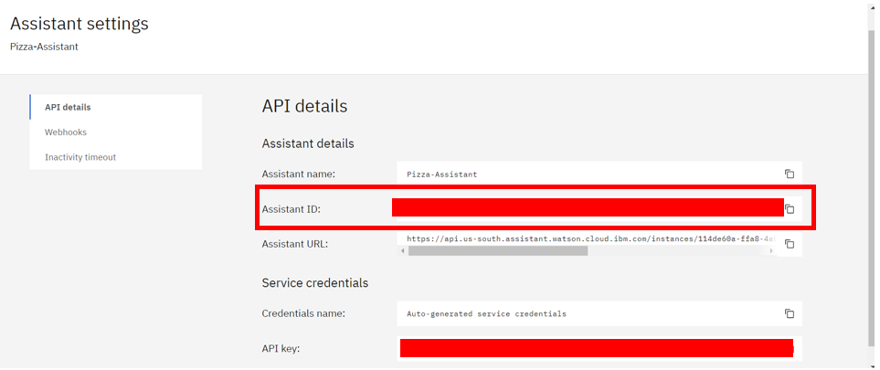

## Step 3: Create Speech to Text Service on IBM Cloud

1. On the principal dashboard of IBM Cloud search for "Speech to Text" and select it.

2. Select a region, choose the lite plan for your service, and scroll down to assign a name. Then click on **Create**.

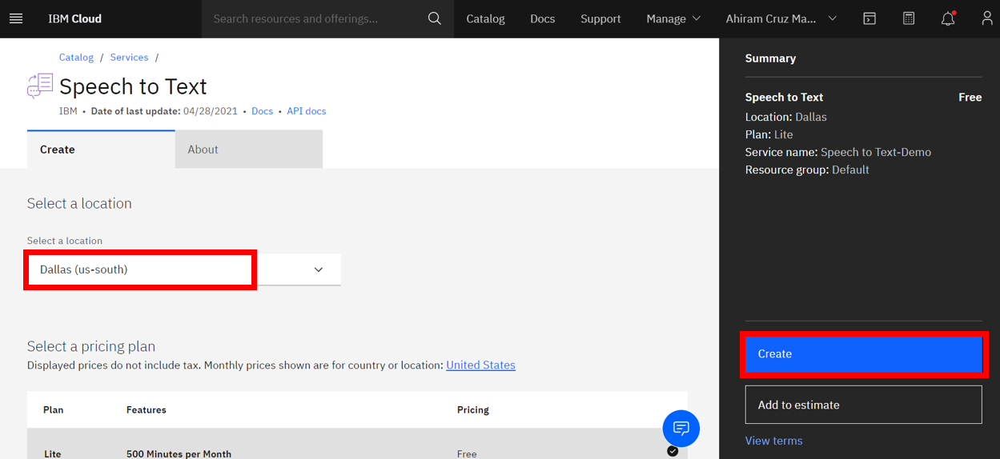

3. Go to the **Manage tab** and copy your credentials on a safe place with the previous ones of Watson Assistant

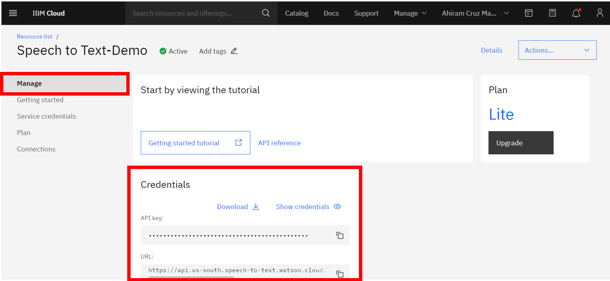

## Step 4: Create Text to Speech Service on IBM Cloud

1. On the principal dashboard of IBM Cloud search for "Text to Speech" and select it.

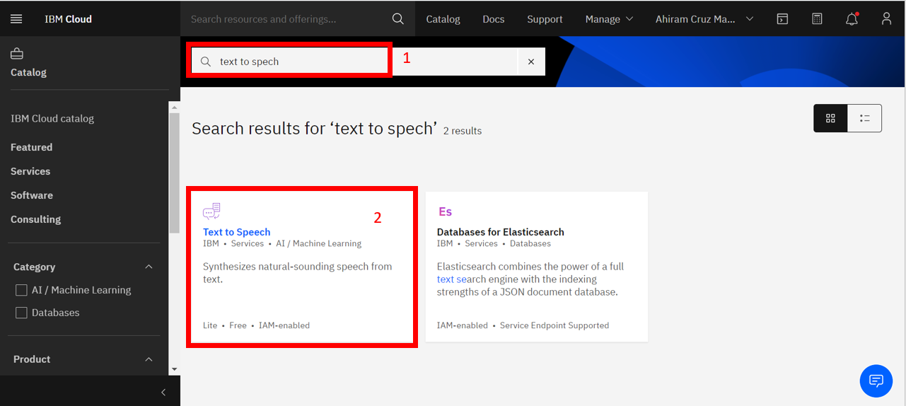

2. Select a region, choose the lite plan for your service, and scroll down to assign a name. Then click on **Create**.

3. Go to the **Manage tab** and copy your credentials on a safe place with the previous ones.

## Step 5: Configure the project to add the credentials

1. On your local machine, open the `05_ChatbotIntegration_STT_TTS_WAssistant` find the file `.env copy` and change its name to `.env`.

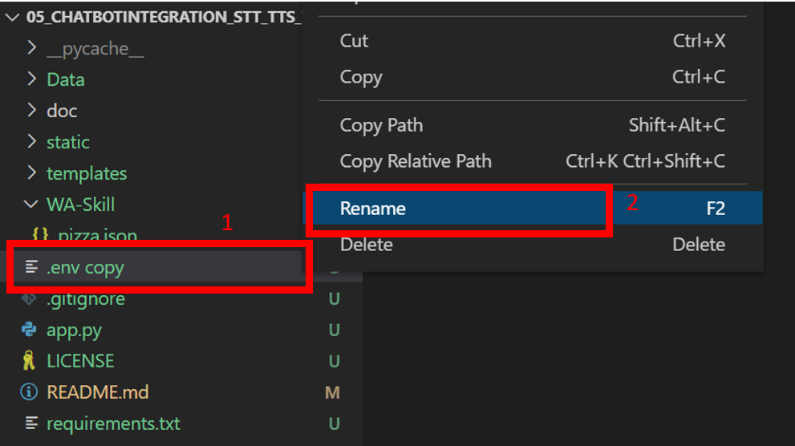

2. Copy your credentials on the corresponding field.

  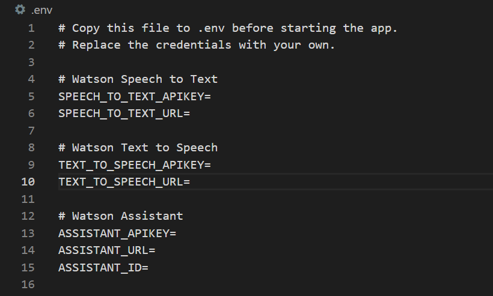

## Step 6: Run the application 

You can run your application directly or create a test environment. We trutly recomend the second option.

1. Create a test environment. **Note:** If "python" does not work, try with "python3".

`python -m venv testenv`

2. Now source the virtual environment. Use one of the two commands depending on your OS.

` source testenv/bin/activate  # Mac or Linux`
` ./testenv/Scripts/activate   # Windows PowerShell `

TIP 💡 To terminate the virtual environment use the deactivate command.

3. Run the application 

`pip install -r requirements.txt`
`python app.py`

4. Open the browser and navigate to : http://localhost:8000

## Step 7: Test the application

1. Click on the "Start Conversation" button.

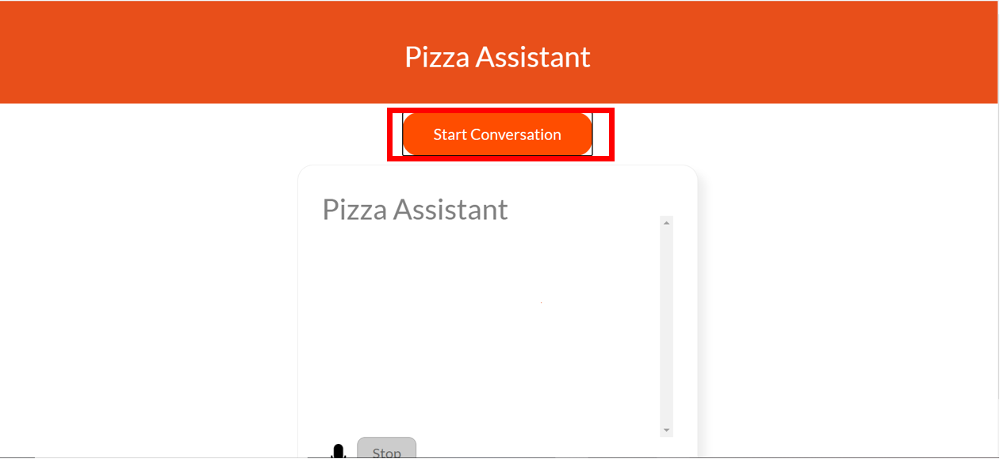

2. Wait for Watson to answer and then start recording your audio. We recommend to use the following dialogues:

`Watson: Welcome to Pizza Topping Basic demonstration, you can order a pizza out of few selected types and sizes and add selected toppings. Ask for Help if needed.`

`You: Hello! What can I do here?`

`Watson: You can order a small, medium or large pizza. Types are Cheese, and you can add more ingredients, margherita, quatro formaggi, and vegetarian.`

`You: I want a medium pizza of cheese`

`Watson: Any extra toppings?`

`You: Pepperoni please`

`Watson: O.K., adding one extra Thank you for ordering a medium cheese pizza with pepperoni .`
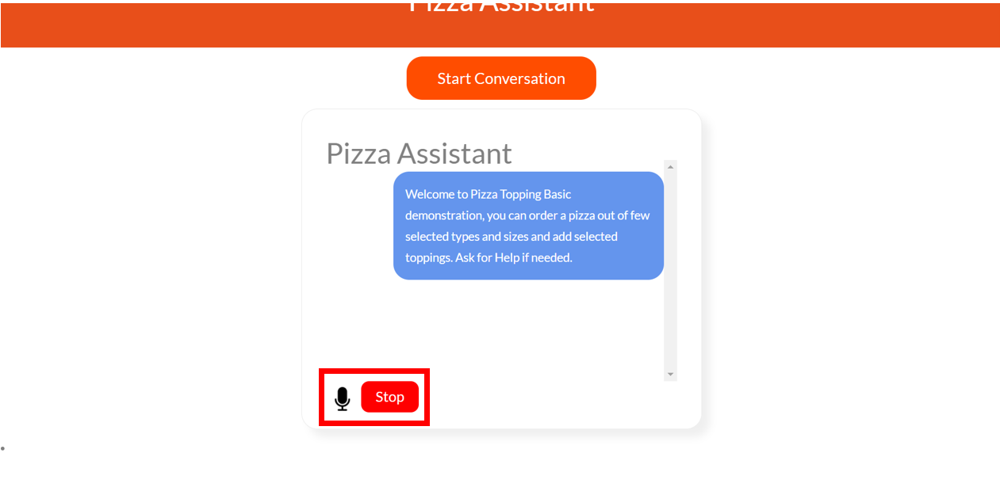

**Note: Receiving audio can be a bit slow, please be patient and start recording when watson has finished saying it's dialog**

# Conclusions

With these tutorial you were able to create a solution for a Pizza service. Without almost any code you integrate 3 services to take to the next level Watson Assistant. Now you are able to create chatbots with voice. If you want to continue exploring all the benefits of these services we encourage you to explore the next steps.

# Next Steps

To continue exploring the services you can explore:

- [IBM Developer Page (English)](https://developer.ibm.com/)
- [IBM Cloud Docs](https://cloud.ibm.com/docs)
- [Watson Assistant Docs](https://cloud.ibm.com/docs/assistant?topic=assistant-getting-started)
- [Speech to Text Docs](https://cloud.ibm.com/docs/speech-to-text-icp?topic=speech-to-text-icp-gettingStarted)
- [Text to Speech](https://cloud.ibm.com/docs/text-to-speech?topic=text-to-speech-gettingStarted)

# Navegation

Links to index and sections. Remember to always point to the README.md.

- [↗ Main Index](/README.md)
- [←  Previous Section](/04_ChatbotCreationDeployment_WAssistant/README.md)
